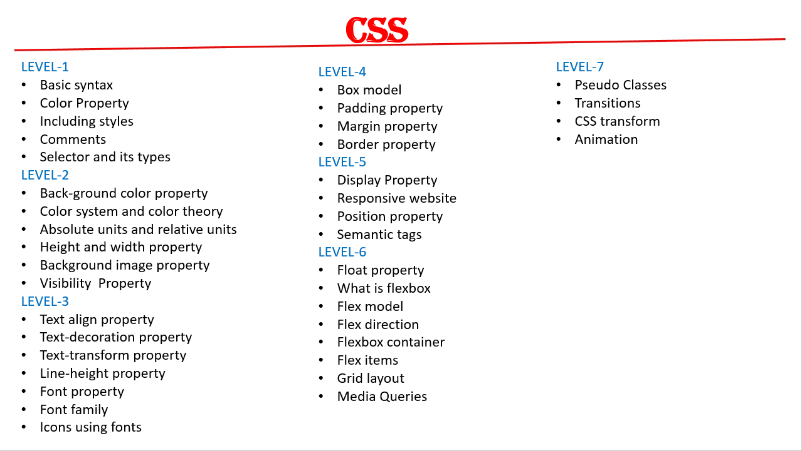
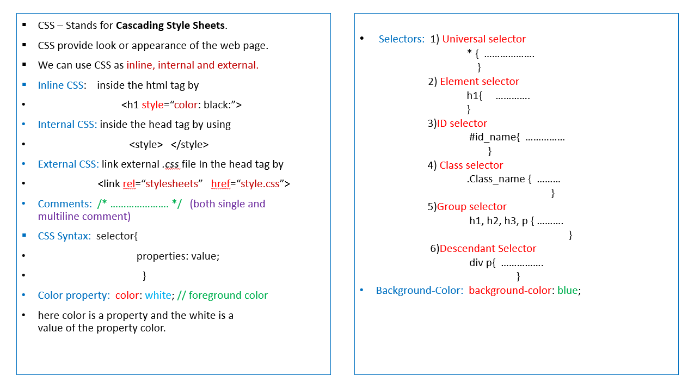
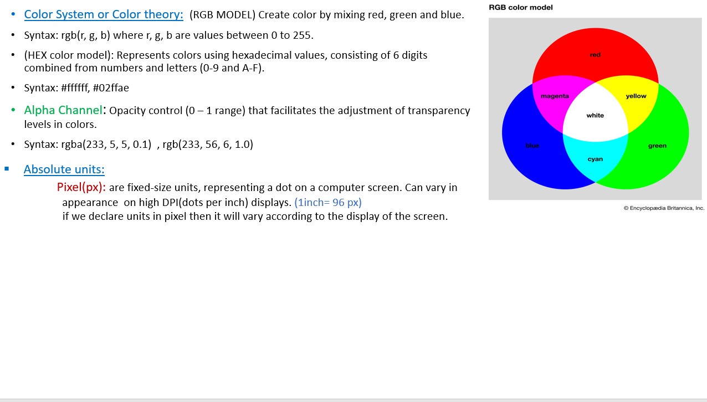
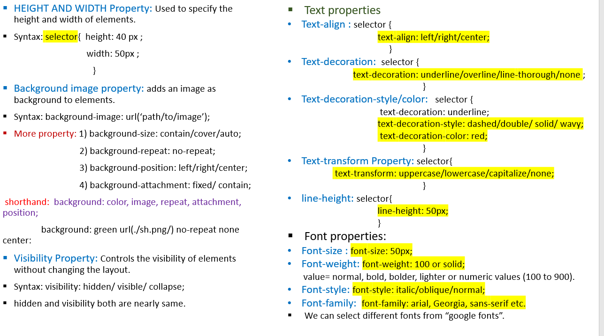
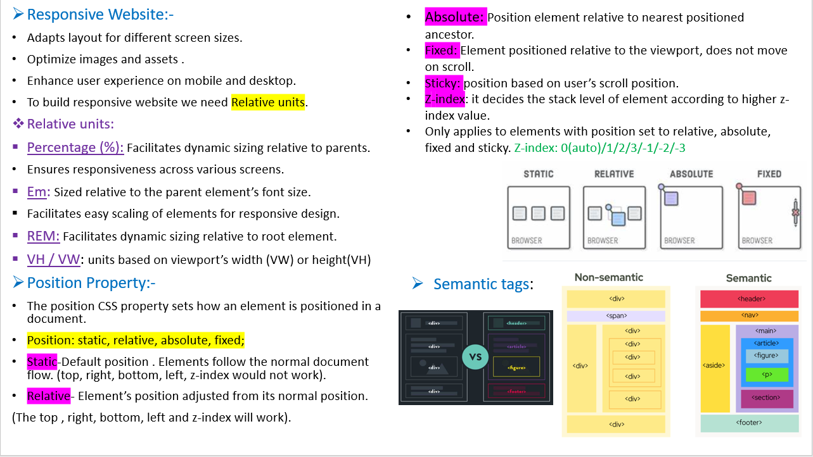
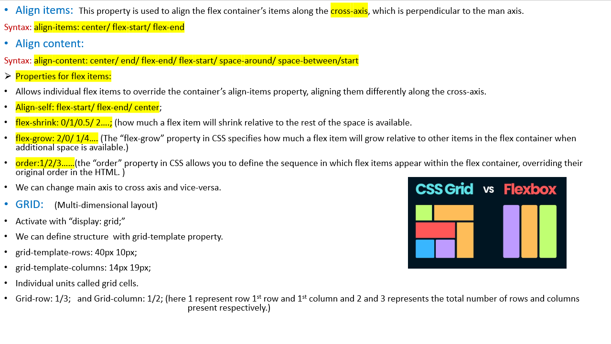
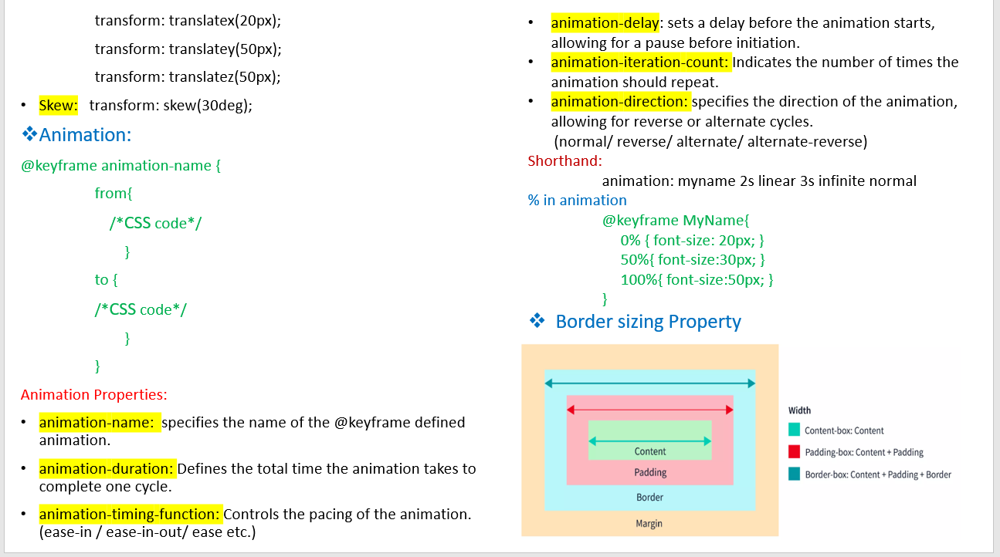

# CSS-Basics

Hello everyone🙋‍♀️  
-In this repo we can revise the basic of CSS

---

Basically **CSS** stands for ***Casceding Style Sheets***.  
-It is use for Style and design web pages.  
-It controls how a website looks.

---

---

---

---

---

---

---

---

---

---

---
